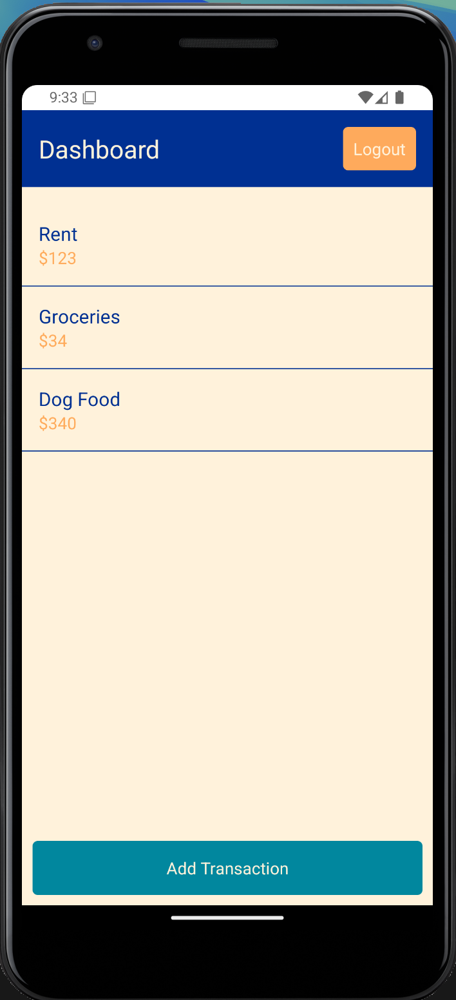
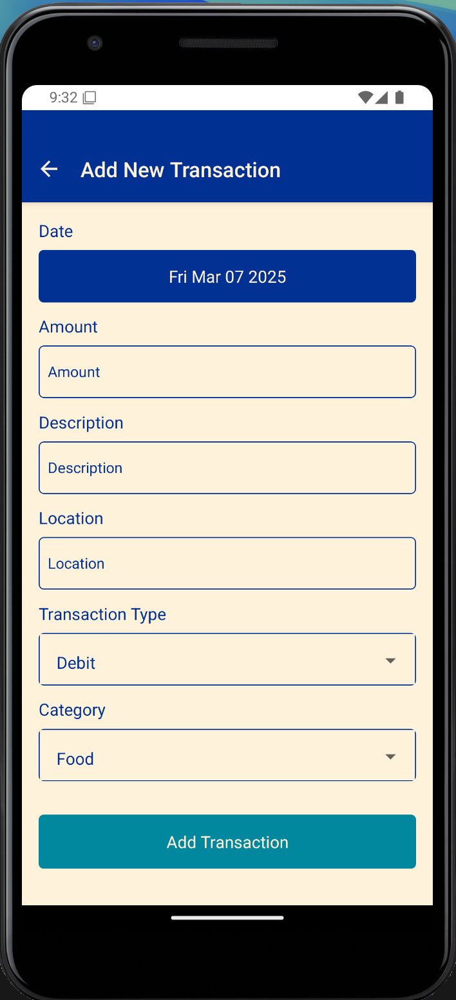
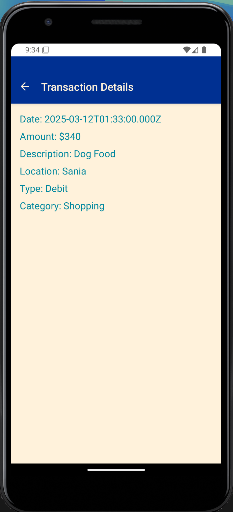

# Expense Tracker

Expense Tracker is a React Native application that allows users to track their expenses. The app includes features such as adding transactions, viewing transaction details, and managing user authentication.

## Features

- User authentication (Sign In)
- Add new transactions
- View transaction details
- Dashboard to view all transactions

## Screens

- **Sign In Screen**: Allows users to sign in with their credentials.
- **Dashboard Screen**: Displays a list of all transactions and provides options to add new transactions or log out.
- **Add Transaction Screen**: Allows users to add a new transaction with details such as date, amount, description, location, transaction type, and category.
- **Transaction Details Screen**: Displays detailed information about a specific transaction.

## Screenshots

### App in Action


### Screens

| Sign In Screen | Dashboard Screen |
| --- | --- |
|  |  |

| Add Transaction Screen | Transaction Details Screen |
| --- | --- |
|  |  |

## Installation

1. Clone the repository:

   ```sh
   git clone https://github.com/your-username/expense-tracker.git
   cd expense-tracker